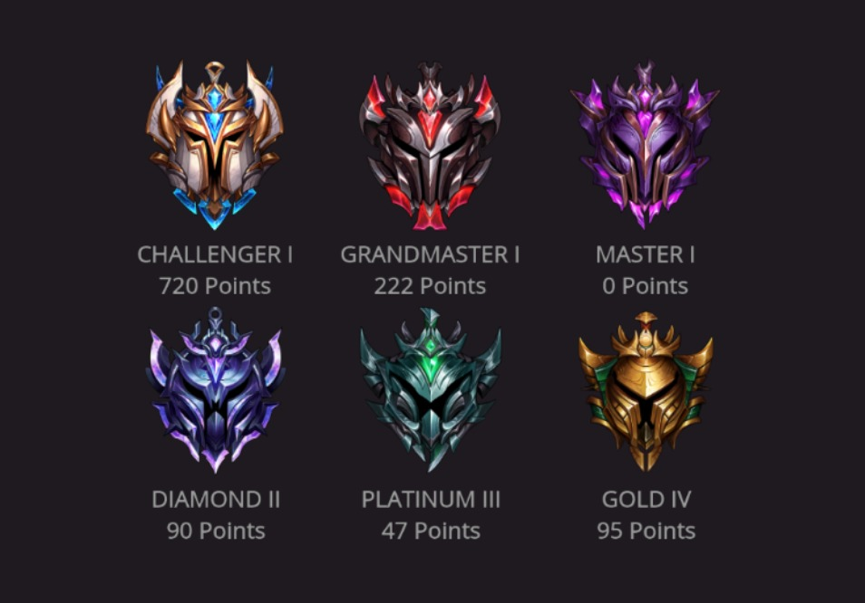

# Stream Widget for League of Legends' Ranking 
A stream widget that displays your ranking on League of Legends 5x5 solo queue and its emblem.



## Running the web server
- clone or download this repository

- run  ``` npm install```

- add a .env file in the root of the project containing the following variables:
    ``` 
    PORT=3000
    LOL_API_KEY=<YOUR API KEY>
    ```

    you can get your api key on [League of Legends' API website](https://developer.riotgames.com/)

- run ```npm start```

- access ```localhost:3000/lol/<your_summoner's_name>```

- you are good to go!


## Integrating it into OBS Studio

- in OBS Studio, add a new **Browser Source** into your Scene
    - if you are using a linux distribution, maybe you will have to download the Linux Browser plug-in.

- paste your URL

- adjust size to *280x320*
